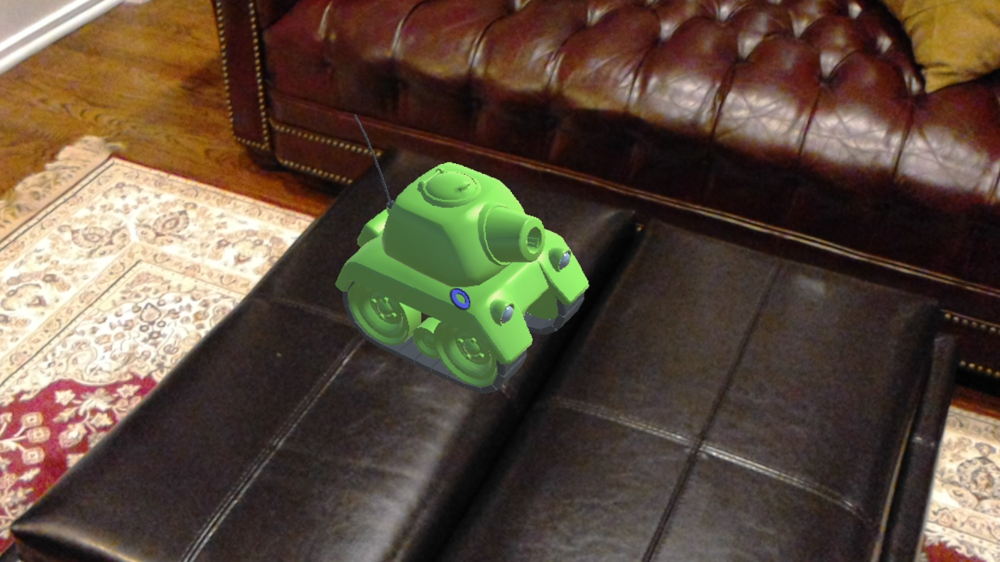

# HoloTank-Demo
Simple holographic viewer demo to show a 3D model in a mixed reality setting using [Microsoft HoloLens](http://hololens.com).

The demo shows a holographic tank, which was imported from the [Tanks! Tutorial](https://www.assetstore.unity3d.com/en/#!/content/46209) from Unity Essentials, introduced at Unity Training Day 2015.

**Unity version: 5.5.0f3 Release.**

## Features
* Simple model viewer app that displays a tank floating 2 meters in front of the user at launch
* Gaze around the space to move the tank and tap to lock the tank in place
* Say "Rotate model" out loud to make the tank spin in place, or "Stop rotation" to stop it
* Show or hide the spatial mesh of your environment with the "display mesh" and "hide mesh" voice commands
* Tank idling sound now uses spatial sound on HoloLens

## Implementation Notes
* The tank doesn't have any Rigidbody gravity setting turned on for now.
* There is some leftover drag on the tank that neds to be fixed since it has a tendency to drift after being placed by the user.

## Follow Me
* Twitter: [@ActiveNick](http://twitter.com/ActiveNick)
* Blog: [AgeofMobility.com](http://AgeofMobility.com)
* SlideShare: [http://www.slideshare.net/ActiveNick](http://www.slideshare.net/ActiveNick)
